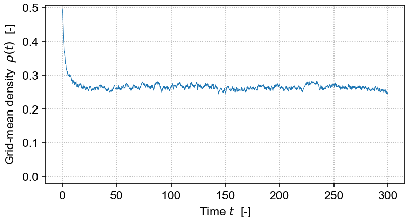

# DP Langevin
## Operator-splitting method of integrating directed percolation (DP) Langevin equations

<!--  -->

Python interface to C++ code implementing the operator-splitting method of integrating directed percolation (more generally, absorbing phase transition) Langevin equations originally developed by Dornic et al (2005), Pechenik & Levine (1999) and others, and improved upon by Weissmann et al (2018).
Adapted heavily from code developed by Paula Villa Martín, extended by Victor Buendía, and arising from earlier code written by Ivan Dornic and Juan Bonachela.

The equation solved in the demo here is the DP Langevin for a 2D grid with initial values sampled from U[0,1]: 

<!-- $`\partial_t \rho = a\rho - b\rho^2 + D \nabla^2 \rho + \gamma \sqrt{\rho} \, \eta`$ -->

where ρ(x,t) is the order parameter field, a and b are rate constants, D is the diffusion rate, η(x,t) is Gaussian white noise (uncorrelated, zero mean, unit variance), and γ is the "demographic" noise amplitude.

See 
[Victor Buendía's fork of Paula Villa Martín's repo](https://github.com/VictorSeven/Dornic_et_al_integration_class/tree/victor-update)
 for details on more general applications and on how the integration scheme is implemented.

## Usage

Info on how to build is provided in the [`src/`](https://github.com/cstarkjp/DPLangevin/tree/main/src/README.md) directory. The build system is [meson-python](https://mesonbuild.com/meson-python/), and [pybind11](https://pybind11.readthedocs.io/en/stable/) is the C++ wrapper. 

Simple demos are provided in the [`test/`](https://github.com/cstarkjp/DPLangevin/tree/main/test/README.md) directory.

## References

   - [Buendía, 2019: "Dornic integration method for multipicative [sic] noise" (fork of GitHub repo by Villa Martín)](https://github.com/VictorSeven/Dornic_et_al_integration_class/tree/victor-update)   [[shared PDF]](https://www.dropbox.com/scl/fi/jzu0hxbifu8g8njglwfh1/VillaMartin_2014_CatastrophicShiftsDPLangevinSimulation2D.pdf?rlkey=i9s6s1i19jtgk6pua7xwdaa1a&st=qpfzqyyw&dl=0) 

   - [Buendía et al, 2020: "Feedback mechanisms for self-organization to the edge of a phase transition"](https://www.frontiersin.org/journals/physics#editorial-board)   [[shared PDF]](https://www.dropbox.com/scl/fi/oh7j5goqeggfmrc5414ir/Buendia_2020_FeedbackSelfOrganizationPhaseTransitions.pdf?rlkey=ot37k7mw7iaymcgs3g9jg4yhu&st=5stsyu8m&dl=0) 

   - [Dornic et al, 2005: "Integration of Langevin equations with multiplicative noise and the viability of field theories for absorbing phase transitions"](https://doi.org/10.1103/PhysRevLett.94.100601)   [[shared PDF]](https://www.dropbox.com/scl/fi/g0h355kxiq47zmxyxlxue/Dornic_2005_MultiplicativenoiseLangevinIntegrationDirectedPercolation.pdf?rlkey=aj5k6zekitc02lno0b50yhjbx&st=vzd5hdfz&dl=0)

   - [Pechenik & Levine, 1999: "Interfacial velocity corrections due to multiplicative noise"](https://doi.org/10.1103/PhysRevE.59.3893)   [[shared PDF]](https://www.dropbox.com/scl/fi/ylu6r5vk34r9sdv8aoiqh/PechenikLevine_1999_MultiplicativeNoiseNonequilibriumPhaseTransitionSDE.pdf?rlkey=90ncj263w5n41hncosiww5n41&st=7uuvp79z&dl=0)

   - [Villa Martín et al, 2014: "Eluding catastrophic shifts"](https://doi.org/10.1073/pnas.1414708112)   [[shared PDF]](https://www.dropbox.com/scl/fi/jzu0hxbifu8g8njglwfh1/VillaMartin_2014_CatastrophicShiftsDPLangevinSimulation2D.pdf?rlkey=i9s6s1i19jtgk6pua7xwdaa1a&st=qpfzqyyw&dl=0) 

   - [Villa Martín, 2019  (GitHub repo): "Dornic integration method for multipicative [sic] noise"](https://github.com/pvillamartin/Dornic_et_al_integration_class)   [[shared PDF]](https://www.dropbox.com/scl/fi/sdeiwyxjpyx6a2tv5vibr/VillaMartin_2019_DornicMethod.pdf?rlkey=wykox7ifyu0ms4pd3hokp1d4u&st=xir9d3vt&dl=0) 

   - [Weissmann et al, 2018: "Simulation of spatial systems with demographic noise"](https://doi.org/10.1103/PhysRevE.98.022131)   [[shared PDF]]() 
